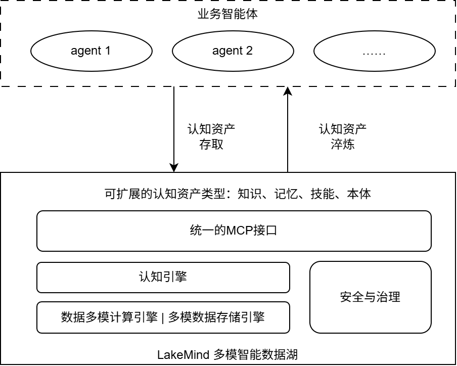
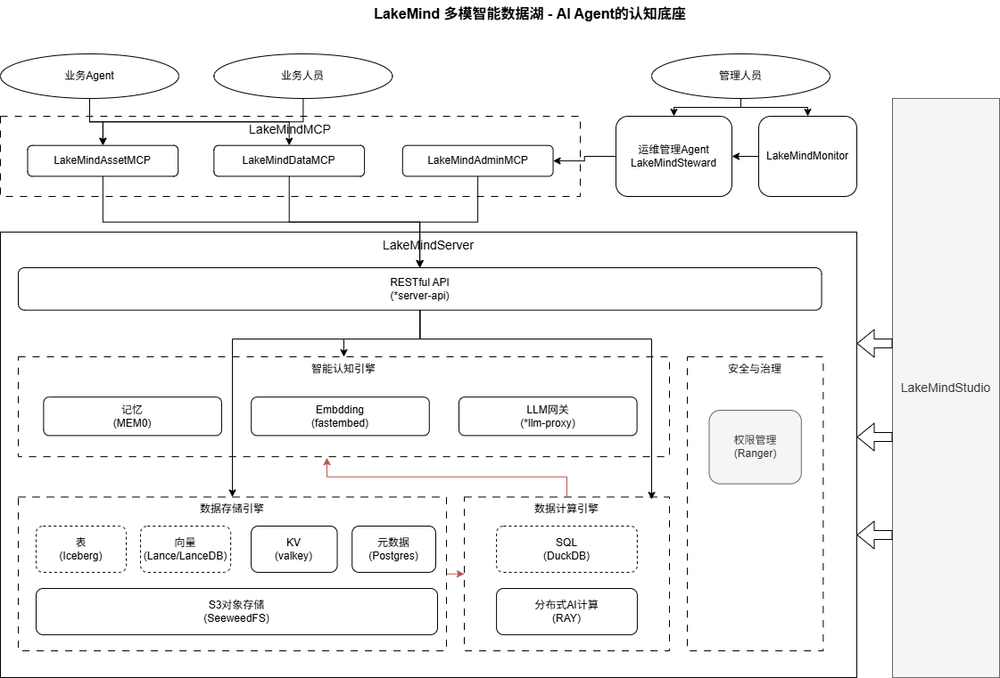

# LakeMind — 多模智能数据湖

> Agent 原生的多模态智能数据底座。统一存储、统一元数据、计算与引擎分离，Agent 通过 MCP 直连引擎。

---

## 你为什么必须要用 LakeMind？

你有 10 个 Agent，你的团队有 100 个 Agent，你的公司有 1000 个 Agent。

它们认知混乱——每个 Agent 各自维护一套知识，同一个概念在不同 Agent 眼中含义不同，没有人能统一描述"我们到底知道什么"。

它们知识碎片化——A Agent 昨天学到的经验，B Agent 今天还要重新踩坑；团队积累的技能以散落在各处的 prompt、文件、对话记录的形式存在，无法被检索、复用、传承。

它们记忆丢失——对话结束，上下文清空，Agent 的一切认知归零。你给每个 Agent 接了向量数据库，但十套八套互不相通，租户隔离、权限控制、生命周期管理全靠手写。

它们数据割裂——结构化数据在 Iceberg 里，向量在 LanceDB 里，文件在 S3 里，图在 Neo4j 里，缓存在 Redis 里。每个 Agent 要对接五种存储、六种 SDK，开发一个能用的 Agent 门槛高得离谱。

**LakeMind 解决的就是这个问题。**

它为 Agent 提供一个统一的认知数据底座：所有数据、知识、记忆、技能、本体都在同一个地方，用同一套 API 访问，同一套元数据管理，同一套权限体系治理。Agent 不需要关心数据存在哪种引擎里——它只需要声明自己需要什么资产，LakeMind 负责剩下的一切。

---

## LakeMind 是什么

LakeMind 是 **Agent 原生的多模态智能数据底座**（Agent-Native Multimodal Intelligent Data Foundation）。

它不是数据库，不是向量存储，不是 RAG 框架，不是 Agent 框架。它是这些东西之上的**统一认知数据层**——把多模态数据存储、结构化表管理、向量检索、图存储、KV 缓存、分布式计算、LLM 推理网关、记忆引擎、资产编排、租户治理，收敛为一个 Agent 可直接消费的数据平面。

Agent 通过 MCP 协议直连 LakeMind，获得**声明式资产访问**能力：不写 SQL，不调 SDK，不管存储——声明"我需要一个知识库"或"我需要回忆上次的经验"，LakeMind 自动路由到正确的引擎、正确的租户空间、正确的权限边界。

**一句话定位**：LakeMind 是 Agent 时代的数据操作系统——就像 Kubernetes 是容器时代的操作系统一样。

<p align="center">
  
</p>

---

## 技术架构

### 总览

<p align="center">
  
</p>

```
┌─────────────────────────────────────────────────────────────────────────┐
│                            开发平面                                      │
│                     LakeMindStudio (Tauri 桌面)                          │
│              资产设计器 · MCP调试台 · Skill脚手架 · CI/CD                  │
└─────────────────────────────────────────────────────────────────────────┘
                                      │ MCP Client
                                      ▼
┌─────────────────────────────────────────────────────────────────────────┐
│                          运行平面 · Agent 侧                             │
│                                                                         │
│  ┌──────────────┐     ┌──────────────────────────────────────────────┐  │
│  │  N Agents     │     │            LakeMindSteward                    │  │
│  │  (业务 Agent)  │     │     LangGraph 巡检 + 对话管理 Agent           │  │
│  └──────┬───────┘     │     连 3 个 MCP (asset+data+admin)            │  │
│         │ asset                    │                   │ admin           │
│         ▼                          ▼                   ▼                 │
│  ┌─────────────┐    ┌─────────────┐    ┌─────────────┐                  │
│  │ AssetMCP    │    │  DataMCP    │    │  AdminMCP   │                  │
│  │  :8401      │    │  :8402      │    │  :8403      │                  │
│  │ 认知资产面   │    │  数据面     │    │  管理面     │                  │
│  └──────┬──────┘    └──────┬──────┘    └──────┬──────┘                  │
└─────────┼──────────────────┼──────────────────┼─────────────────────────┘
          ▼                  ▼                  ▼
┌─────────────────────────────────────────────────────────────────────────┐
│                        数据平面 · LakeMindServer                          │
│                                                                         │
│  REST API 网关 (:10823) — 统一引擎入口，40+ OpenAPI 路径                  │
│                                                                         │
│  ┌─────────────────┐  ┌─────────────────┐  ┌─────────────────┐          │
│  │  数据存储引擎    │  │  数据计算引擎    │  │  认知计算引擎    │          │
│  │  SeaweedFS (S3) │  │  Ray (分布式)   │  │  fastembed      │          │
│  │  Iceberg (表)   │  │  DuckDB (SQL)  │  │  LLM Gateway    │          │
│  │  Lance/LanceDB  │  │                 │  │  Memory Engine  │          │
│  │  Valkey (KV)   │  │                 │  │                 │          │
│  │  PostgreSQL     │  │                 │  │                 │          │
│  └─────────────────┘  └─────────────────┘  └─────────────────┘          │
└─────────────────────────────────────────────────────────────────────────┘

          ┌─────────────────────────────────────────────┐
          │              LakeMindMonitor (:3000)          │
          │   Express · 三面监控 · Chat(→Steward) · 极轻   │
          └─────────────────────────────────────────────┘
```

### 2 层数据类型

LakeMind 将 Agent 需要的一切数据分为两层，用不同的 MCP 面提供访问：

| 层 | 定位 | 访问面 | 说明 |
|----|------|--------|------|
| **认知资产层 (ASSET)** | 面向 Agent 认知模型的语义封装 | AssetMCP | 知识、技能、记忆、本体——声明式 YAML 定义，预置 4 类，可删可扩。Agent 不关心底层存储，只声明"我需要一个知识库" |
| **数据层 (DATA)** | 多模态数据底座，透传不做语义解释 | DataMCP | 数据是什么、存哪、怎么读写。Iceberg 表、Lance 向量、S3 文件、Valkey KV、PG 图——全量透传给 Steward 和高级 Agent |

### 3 个 MCP 服务

Agent 通过 MCP 协议直连 LakeMind。三个 MCP 独立部署、各自水平扩展、scope 隔离：

| MCP | 端口 | Scope | 面向 | 工具数 | 职责 |
|-----|------|-------|------|--------|------|
| **LakeMindAssetMCP** | 8401 | `asset` | 业务 Agent | 23 tools, 11 resources, 6 prompts | 认知资产面：知识检索/摄入、技能管理、记忆读写、本体查询 |
| **LakeMindDataMCP** | 8402 | `data` | Steward / 高级 Agent | 18 tools, 6 resources, 2 prompts | 数据面：Iceberg/DuckDB/LanceDB/S3/Valkey/Graph 全量透传 |
| **LakeMindAdminMCP** | 8403 | `admin` | Steward | 17 tools, 6 resources, 2 prompts | 管理面：用户/租户/Token/资产类型/平台健康 |

### 核心服务 LakeMindServer 与 3 大引擎

LakeMindServer 是数据平面的核心，提供 REST API 网关（40+ OpenAPI 路径）和 3 大引擎类别：

**数据存储引擎**：

| 引擎 | 选型 | 用途 |
|------|------|------|
| 对象存储 | **SeaweedFS** | S3 兼容，存 Iceberg 数据文件 / Lance 向量 / Skill 代码 |
| 表格式 | **Apache Iceberg** | 结构化表，PyIceberg 嵌入式，PG SQL catalog |
| 向量 / 多模态 | **PyLance + LanceDB** | 向量检索，共享 Lance 目录 |
| KV 缓存 | **Valkey** | Redis 兼容 TTL KV，短期/工作记忆（BSD 3-Clause） |
| 统一元数据 | **PostgreSQL 16** | Iceberg catalog + 图存储 + 用户/租户/Token + 资产定义 |
| 图 / 本体 | **PG 原生表** | graph_nodes / graph_edges + JSONB |

**数据计算引擎**：

| 引擎 | 选型 | 用途 |
|------|------|------|
| 即席 SQL | **DuckDB** | 进程内轻量 SQL，即席分析 |
| 分布式计算 | **Ray 2.41** | 3 节点 12 CPU，批量 embedding / 并行检索 / 重计算 |

**认知计算引擎**：

| 引擎 | 选型 | 用途 |
|------|------|------|
| Embedding | **fastembed** | ONNX + jinaai/jina-embeddings-v2-base-zh，dim=768，中英混合 |
| LLM 网关 | **GatewayLLM** | 多 provider 路由 + fallback，支持 OpenAI/DeepSeek/Anthropic/Ollama |
| 记忆引擎 | **BasicMemory** | 短期 Valkey TTL + 长期 Lance 向量 + PG 元信息（mem0 风格） |

### 配套工具

| 工具 | 定位 | 状态 |
|------|------|------|
| **LakeMindSteward** | 管理运维 Agent（LangGraph）：对话式管理 + 自主巡检，连 3 个 MCP | ✅ 已完成 |
| **LakeMindMonitor** | 人类只读仪表板 + Steward 对话窗（Express，极轻，无自有 DB） | ✅ 已完成 |
| **LakeMindStudio** | 桌面客户端（Tauri）：资产设计器、MCP 调试台、Skill 脚手架、CI/CD | 🔨 待开发 |

**REST API 网关**：LakeMindServer 提供 40+ OpenAPI 路径的统一 REST API，MCP 通过 httpx 连接池调用，支持 11 引擎健康检查、Bearer 认证、租户/Agent/Scope 三级上下文。

**管理/治理面**：AdminMCP 提供用户/租户/Token/资产类型 CRUD，PostgreSQL 行级租户隔离，Token scope 控制 MCP 访问边界。

---

## 数据域 → 引擎映射

| 数据域 | 引擎 | MCP 资产 | 资源 URI |
|--------|------|---------|----------|
| 结构化数据 | Iceberg + PG catalog | `lake://data` | DataMCP 透传 |
| 知识 / 多模态 RAG | Lance + LanceDB | `lake://knowledge` | AssetMCP |
| 短期/工作记忆 | Valkey (TTL KV) | `lake://memory` | AssetMCP |
| 长期/语义记忆 | Lance 向量 + PG 元信息（mem0 风格） | `lake://memory` | AssetMCP |
| Skills | S3 + PG + LanceDB | `lake://skills` | AssetMCP |
| 本体 / 图 | PG graph_nodes/edges | `lake://ontology` | AssetMCP |
| LLM 推理 | GatewayLLM → 外部 API | `/api/v1/cognitive/llm` | REST API |

> 长期记忆采用 Lance 向量 + PG 元信息双表设计（mem0 风格），通过 `lance_uri` 字段关联。

---

## 验证状态

| 验证套件 | 脚本 | 结果 |
|----------|------|------|
| 全面测试 L0-L9 | `scripts/verify_full.py` | ✅ 297/297 PASS |
| PG catalog | `LakeMindServer/scripts/verify_pg_catalog.py` | ✅ 8/8 PASS |
| Ray 分布式 | `LakeMindServer/scripts/verify_ray.py` | ✅ 12/12 PASS |
| LLM 模型网关 | `scripts/verify_llm.py` | ✅ 10/10 PASS |
| Monitor | `LakeMindMonitor/scripts/verify_monitor.py` | ✅ 18/18 PASS |

### 引擎健康（11 引擎全部 true）

```
object_storage:  true   tabular:         true   vector:     true
kv:              true   graph:           true   metadata:   true
sql:             true   distributed:     true   embedding:  true
memory:          true   llm:             true
```

---

## 部署模式

### 单机 docker-compose（MVP）

```bash
# 1. 数据平面（4 容器 + Ray 3 容器）
cd LakeMindServer
docker compose --env-file .env --profile ray up -d

# 2. 三个 MCP（3 容器）
cd LakeMindMCP
docker compose --profile all up -d --build

# 3. Steward + Monitor（2 容器）
cd LakeMindMonitor
docker compose up -d --build
```

### 运行容器（12 个）

| 容器 | 端口 | 用途 |
|------|------|------|
| lakemind-server-api | 10823 | REST API 网关 (40+ 路径) |
| lakemind-postgres | 5432 | 统一元数据 + 图存储 |
| lakemind-seaweedfs | 8333 | S3 对象存储 |
| lakemind-valkey | 6379 | TTL KV 缓存 |
| lakemind-ray-head | 8265 | Ray dashboard (4 CPU) |
| lakemind-ray-worker-1/2 | — | Ray worker (各 4 CPU) |
| lakemind-asset-mcp | 8401 | 认知资产面 (23 tools) |
| lakemind-data-mcp | 8402 | 数据面 (18 tools) |
| lakemind-admin-mcp | 8403 | 管理面 (17 tools) |
| lakemind-steward | 8500 | 管理运维 Agent |
| lakemind-monitor | 3000 | 人类仪表板 |

### 引擎切换

所有引擎通过 `engines.yaml` 配置切换，不改代码：

```yaml
cognitive:
  embedding:
    plugin: fastembed    # fastembed | (future: external, tei)
  llm:
    plugin: gateway      # gateway → 多 provider 路由
  memory:
    plugin: basic        # basic | (future: mem0)
compute:
  distributed:
    plugin: ray          # embedded | ray
```

---

## 租户隔离

| 层 | 隔离方式 |
|----|----------|
| S3 | key 前缀 `{tenant_id}/` |
| Iceberg | namespace `{tenant_id}_{domain}` |
| LanceDB | 每租户独立 database |
| Valkey | key 前缀 `{tenant_id}:` |
| PostgreSQL | 行级 `tenant_id` 列（应用层过滤） |

---

## 设计原则

1. **统一存储底座** — SeaweedFS 一个对象存储承载全部数据文件
2. **统一元数据** — PostgreSQL 一个数据库承载全部结构化元数据
3. **计算与引擎分离** — 引擎适配层可替换，计算可走嵌入式或 Ray

---

## 技术栈

全开源组件（Apache 2.0 / MIT / BSD），不引入闭源依赖：

| 组件 | 选型 | 许可证 |
|------|------|--------|
| 对象存储 | SeaweedFS | Apache 2.0 |
| 表格式 | Apache Iceberg | Apache 2.0 |
| 向量 / 多模态 | PyLance + LanceDB | Apache 2.0 / MIT |
| 元数据 / 图 | PostgreSQL 16 | PostgreSQL License |
| 缓存 / 短期记忆 | Valkey | BSD 3-Clause |
| 即席计算 | DuckDB | MIT |
| 分布式计算 | Ray | Apache 2.0 |
| Embedding | fastembed | Apache 2.0 |
| LLM 网关 | GatewayLLM (自建) | — |
| MCP SDK | FastMCP | MIT |
| Agent 框架 | LangGraph | MIT |
| Monitor | Express | MIT |

---

## License
本项目遵循：Apache 2.0 协议。
