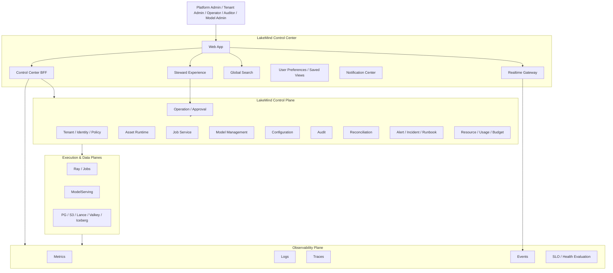

# LakeMind Control Center 世界级改造设计方案

> **文档性质**：产品重构、交互设计、平台架构与实施指导方案  
> **适用范围**：LakeMind v0.2.x Control Center 重构，并为 v0.3.0 多节点和 v0.4.0 LakeMindStudio 预留稳定基础  
> **版本定位**：LakeMind 的统一控制平面产品，而不是后台管理页面集合  
> **基准日期**：2026-07-15

---

# 0. 执行摘要

当前 LakeMind Control Center 已经完成了“统一入口”的外形，但尚未形成真正的控制中心。其核心问题不是页面数量不足，而是：

1. **没有完整的管理对象模型**：租户、组织、配额、角色、策略、资源、告警、事故、变更、运行预算等关键对象缺失；
2. **没有控制闭环**：多数页面只能查看列表，不能完成配置、审批、执行、恢复和验证；
3. **没有系统级观测模型**：实例、资产、Job、模型、存储、计算、配置、审计之间彼此割裂；
4. **没有面向问题的运维体验**：用户看到“FAILED”“DEGRADED”，却不知道影响范围、根因、下一步动作和处理结果；
5. **没有真正体现 LakeMind 特性**：Knowledge、Skill、Memory、Job、Model、Artifact 及其血缘没有成为产品主角；
6. **Steward 尚未成为治理能力**：当前聊天只是 Echo，巡检存在 Stub，无法形成可信的诊断和行动闭环；
7. **Control Center 自身安全模型不合格**：内存 Session、共享 BFF Token、跨租户可见、依赖租户 Header 等问题与“统一控制中心”的定位冲突。

新版 Control Center 应定义为：

> **LakeMind 全局系统控制平面：统一管理组织与租户、身份与安全、Agent 资产、Job 与执行资源、模型服务、系统配置、运行健康、成本容量、告警事故、治理行动和审计证据。**

其产品目标不是复制 Databricks 或 Snowflake 的页面，而是在它们擅长的数据、计算、治理和成本管理基础上，进一步形成 LakeMind 独有的：

- **Agent 资产运营中心**；
- **从 Skill 到 Job、模型、Artifact、Knowledge、Memory 的端到端血缘**；
- **Desired State / Active State 收敛管理**；
- **Steward 驱动、受权限与审批约束的智能治理闭环**；
- **面向租户、Agent 和任务的资源与成本归因**；
- **能够解释“系统为什么这样运行”的 LakeMind Control Graph**。

---

# 1. 产品定位

## 1.1 一句话定位

> **LakeMind Control Center 是 LakeMind 的管理、治理、运维和可观测性中枢。**

它要让管理员在一个统一入口中回答并处理以下问题：

1. 当前系统是否健康？
2. 哪些租户、Agent、资产或业务流程受到影响？
3. 问题发生在哪个平面、服务、Binding、Job Attempt 或模型 Deployment？
4. 根因是什么，有什么证据？
5. 可以采取哪些动作，风险是什么？
6. 动作是否需要审批？
7. 执行后系统是否真正收敛？
8. 谁在何时修改了什么？
9. 当前资源是否够用，成本和容量是否异常？
10. 新配置、新模型、新租户是否已经真实生效？

## 1.2 与 LakeMindStudio 的边界

| 产品 | 核心用户 | 核心目标 | 主要对象 |
|---|---|---|---|
| **LakeMind Control Center** | 平台管理员、租户管理员、运维、安全、模型管理员、资产治理人员 | 管理、治理、监控、审计、恢复、审批 | Tenant、Principal、Policy、Asset、Job、Model、Service、Config、Operation、Incident |
| **LakeMindStudio** | Agent 开发者、Skill 开发者、知识工程师、应用开发者 | 创建、测试、发布、调试 Agent 资产和应用 | Skill、Knowledge Pipeline、Agent、Workflow、Prompt、Test Case |
| **业务应用** | 最终用户 | 使用已发布能力完成业务任务 | Agent 应用、业务流程、问答、报告 |

Control Center 可以查看和治理 Skill，但不承担 Skill 代码编辑；可以查看 Knowledge 健康和血缘，但不承担复杂知识加工设计；可以查看 Agent 运行情况，但不承担 Agent 工作流开发。

## 1.3 设计原则

### 原则一：不是“页面中心”，而是“对象与行动中心”

每个管理对象必须拥有：概览、健康、配置、权限、关系、历史、指标、日志、操作和审计。

### 原则二：不是“只读监控”，而是完整控制闭环

```text
发现 → 定位 → 解释 → 评估影响 → 提出动作
  → 权限与审批 → 执行 → 验证收敛 → 审计留痕
```

### 原则三：默认面向任务，不默认面向数据库表

用户进入 Control Center，首先看到需要关注的问题、受影响的租户和服务、待审批事项、失败或超时的关键 Job、容量和安全风险、Steward 建议，而不是十张没有上下文的表格。

### 原则四：所有数据都有归属、范围和责任人

每个页面和对象都必须明确当前 Tenant、Environment、时间范围、权限身份、Owner、SLO 或治理责任和数据最后更新时间。

### 原则五：所有修改均可预览、可审计、可回滚

任何重要写操作必须回答：将修改什么、影响哪些对象、是否需要 Reload 或 Restart、是否会中断服务、能否回滚、谁审批、如何确认生效。

### 原则六：智能体不能成为权限旁路

Steward 的能力来自受控工具和 Operation Service，不来自“超级管理员提示词”。

### 原则七：单节点实现，多节点语义

v0.2.x 可以仍是单节点部署，但产品对象、实例模型、资源模型和配置收敛模型必须可以自然扩展到 v0.3.0 多节点。

---

# 2. 竞品基线与超越方向

## 2.1 应吸收的成熟能力

### Databricks 类能力

- 账号、身份、Service Principal 和管理角色；
- 统一目录、权限和血缘；
- Job Run、Task、历史、日志和指标；
- Model Serving Endpoint 的生命周期和监控；
- System Tables 和平台级运行数据；
- 数据质量和异常检测；
- 计算成本和 Job 成本归因。

### Snowflake 类能力

- Snowsight 式统一管理体验；
- 用户、角色、网络、认证和治理；
- Horizon 式统一资产目录与上下文；
- Trust Center 式安全风险视图；
- Resource Monitor、Budget、Usage 和自动动作；
- Query / Task History 的多维分析；
- Alert、Notification 和治理操作。

## 2.2 LakeMind 必须实现的差异化超越

| 维度 | 传统平台常见方式 | LakeMind Control Center 目标 |
|---|---|---|
| 管理对象 | 数据、表、计算、模型 | Knowledge、Skill、Memory、Job、Artifact、Model、Agent 使用关系 |
| 运行血缘 | 数据 Pipeline 或 Query | 输入资产 → Skill 版本 → Job Attempt → 模型 Deployment → Artifact → Knowledge / Memory |
| 治理方式 | 管理员手工判断 | Steward 提供证据化诊断、影响分析和受控行动 |
| 配置生效 | 修改配置后等待 | Desired / Active Revision、收敛状态、漂移检测和回滚 |
| 故障处理 | 查看日志和告警 | 从异常直接进入根因、影响对象、Runbook 和 Operation |
| 多租户 | 工作区或账号隔离 | Tenant、Agent、资产、Job、模型、Secret、预算一体化隔离 |
| 资产质量 | 数据质量 | Agent 资产完整性、Binding 健康、可检索性、可执行性、记忆生命周期 |
| 模型管理 | Endpoint 管理 | Definition、Deployment、Profile、Route、Embedding Space 和 Job 固定绑定 |
| 运维智能体 | AI 助手或搜索 | 受授权、审批、审计约束的 Steward 治理智能体 |
| 系统解释 | 用户自行拼接页面 | LakeMind Control Graph 自动解释对象关系和 Blast Radius |

## 2.3 “世界级”不是页面更多

新版产品的衡量标准应是：

- 管理员能在 **3 次点击以内**从告警进入根因和受影响对象；
- 能在 **一个对象详情页**完成查看、诊断、配置、治理和审计；
- 能在 **一个全局搜索框**找到租户、资产、Job、模型、服务、操作和审计；
- 能在修改配置或模型路由前看到 **影响分析和变更预览**；
- 能在执行治理动作后看到 **收敛验证**；
- 任何跨租户数据都由后端权限过滤，不依赖前端隐藏；
- 对一个失败 Job，能够完整回答“谁、何时、用什么 Skill、输入、模型、配置和 Secret 版本执行，为什么失败”。

---

# 3. 当前方案问题诊断

## 3.1 产品层问题

1. **页面只是薄列表**：Assets、Jobs、Services、Security、Audit 等页面缺少详情、关系、指标和操作上下文。
2. **缉补式页面结构**：页面按照后端已有 Endpoint 拼接，而不是按照管理员工作任务设计。
3. **没有 Tenant 管理**：Tenant 是 LakeMind 安全、资源和资产隔离的根对象，但当前无法创建、配置、暂停、分配管理员或设置配额。
4. **Job 管理不完整**：无法查看 Attempt、执行时间线、队列等待、Skill 版本、输入输出、模型和 Secret 绑定、资源使用、日志 Trace、根因和 Artifact。
5. **Model 管理没有运行闭环**：Control Plane 和 ModelServing 运行时脱节，Profile 没有 Route，Desired State 和 Active State 不一致。
6. **Configuration 不是配置中心**：当前只读键值展示，无法完成 Schema 化编辑、Scope 继承、Diff、校验、激活、回滚和 Drift。
7. **Steward 是“外观智能”**：前端接入 Echo，部分巡检为 Stub，建议和 Operation 没有形成完整交互。

## 3.2 安全层问题

- BFF 内存 Session，重启全部失效；
- BFF 使用共享平台 Token 代替用户委托身份；
- 部分页面跨租户可见；
- 依赖 `X-Tenant-Id` 传递隔离上下文；
- WebSocket 无认证；
- 无完整 CSRF 防护；
- 登录页泄露默认密码提示；
- 前端路由守卫被误当成授权；
- Control Center 的租户和角色上下文不完整。

## 3.3 架构层问题

- BFF 只是 REST 透传层，不是面向 UI 的聚合和工作流服务；
- 缺少实时事件流；
- 缺少全局搜索索引；
- 缺少统一指标、日志、Trace、事件查询层；
- 缺少 Incident、Alert、Runbook、Notification、Change 等运维领域对象；
- Control Center 没有自己的交互状态和用户偏好持久层；
- 管理页面与底层 Application Service 的能力不对称。

---

# 4. 新版总体产品架构

## 4.1 产品逻辑架构



## 4.2 Control Center 的数据原则

| 数据 | 事实源 |
|---|---|
| Tenant、Principal、Policy、Asset、Job、Model、Config、Operation | LakeMind Control Plane / PostgreSQL |
| 服务指标、资源指标、延迟、错误率 | Metrics Store |
| 日志 | Log Store |
| Trace | Trace Store |
| 审计 | Audit Service |
| 搜索 | 可重建 Search Projection |
| 用户界面偏好和 Saved View | Control Center Metadata Store |
| Session | Valkey 或企业身份会话系统 |

Control Center 不得直接修改 PostgreSQL、直接调用 Ray Job API、直接操作 S3/Lance/Valkey、直接修改 ModelServing 内部 Registry、使用共享平台 Token 代替所有用户、依靠前端隐藏实现权限、通过拼接 Tenant Header 实现安全，或将页面缓存作为业务事实源。

## 4.3 LakeMind Control Graph

新版应构建逻辑上的 **LakeMind Control Graph**，不是必须新增图数据库，而是把现有关系统一投影和查询。

核心节点：Tenant、Principal、Group、Service Account、Asset、Binding、Skill Version、Job Run、Attempt、Artifact、Model、Deployment、Profile、Route、Service Instance、Config Revision、Secret Ref、Operation、Incident、Alert、Audit Event。

核心关系：

```text
Tenant OWNS Asset
Principal INITIATES Job
Job EXECUTES SkillVersion
Job READS AssetVersion
Job USES ModelDeployment
Job USES SecretVersion
Job PRODUCES Artifact
Artifact MATERIALIZES_AS Knowledge/Memory
Asset HAS Binding
Service RUNS ConfigRevision
Alert AFFECTS Resource
Operation REMEDIATES Finding
Incident GROUPS Alerts
```

Control Graph 支持全局搜索、血缘、Blast Radius、影响分析，以及“谁在使用这个模型”“禁用 Deployment 会影响哪些 Skill 和 Tenant”“Secret 轮换会影响哪些 Job”等问题。

---

# 5. 用户角色与工作台

## 5.1 平台管理员

关注所有 Tenant、系统健康、平台容量、配置和升级、高风险审批、安全风险、全局成本和多租户公平性。

## 5.2 租户管理员

关注本 Tenant 的成员、Agent、配额、资产、Job、模型权限、使用量、预算、审计和数据保留策略。

## 5.3 运维 / SRE

关注服务拓扑、告警和 Incident、Job Backlog、资源饱和、日志、Trace、Runbook、版本和配置漂移。

## 5.4 安全管理员 / 审计员

关注 Principal、Role、Policy、Token、Session、Secret、网络访问、跨租户拒绝、高风险变更和审计导出。

## 5.5 模型管理员

关注 Model、Deployment、Route、健康、性能、质量、成本、Embedding Space、Secret 和 Tenant 使用权限。

## 5.6 资产治理人员

关注 Knowledge、Skill、Memory 健康、Binding、血缘、质量、生命周期和修复操作。

---

# 6. 全局信息架构

## 6.1 一级导航

```text
Home
Organization
Assets
Runtime
AI & Models
Operations
Security & Governance
Platform
Steward
```

## 6.2 二级导航

- **Home**：Mission Control、My Tasks、Notifications、Recent Changes、Saved Views。
- **Organization**：Tenants、Users & Groups、Service Accounts、Environments、Quotas & Entitlements、Usage & Budgets。
- **Assets**：Asset Catalog、Knowledge、Skills、Memory、Bindings、Lineage、Asset Quality。
- **Runtime**：Jobs、Attempts、Artifacts、Schedules、Compute / Ray、Runtime Policies。
- **AI & Models**：Models、Deployments、Profiles & Routes、Embedding Spaces、Model Usage、Quality & Evaluation、Provider Secrets。
- **Operations**：Operations、Approvals、Alerts、Incidents、Runbooks、Changes、Maintenance Windows、Notifications。
- **Security & Governance**：Principals、Roles & Policies、Tokens & Sessions、Secrets、Access Explorer、Security Findings、Audit、Retention & Classification。
- **Platform**：Services & Topology、Resources & Capacity、Configuration、Versions & Upgrades、Storage、Observability、Feature Flags、System Information。
- **Steward**：Daily Brief、Findings、Recommendations、Conversations、Auto-Governance、Action History。

## 6.3 全局上下文条

页面顶部固定包含 Tenant Selector、Environment Selector、Time Range、Global Search、Command Palette、Notifications、Current Identity / Role、System Health Indicator。

Tenant Selector 必须由后端可访问 Tenant 列表驱动，并自动限制所有查询。

## 6.4 全局搜索

支持搜索 Tenant、Asset、Skill、Job、Model、Deployment、Service、Operation、Incident、Principal、Config Key、Audit Request ID 和 Correlation ID。结果按对象类型分组，并提供快速动作。

## 6.5 Command Palette

示例：创建租户、查看失败 Job、重新索引资产、打开平台配置、切换 Tenant、查找使用某 Deployment 的 Job、运行系统巡检、查看待审批操作。所有命令必须遵循用户权限。


---

# 7. Home：Mission Control

## 7.1 首页不是统计卡片集合

首页采用“运行态势 + 待办 + 风险 + 趋势”的结构。

### 第一屏：需要行动的事项

- Critical / High Incident；
- Pending Approval；
- Tenant Suspension Risk；
- Security Finding；
- Failed Config Rollout；
- Model Deployment Unhealthy；
- Job SLA Breach；
- Asset Drift；
- Capacity Exhaustion Forecast。

### 第二屏：平台健康

按 Access Plane、Control Plane、Data & Index Plane、Execution Plane 展示 Health Score、Error Budget、关键服务、当前告警、受影响 Tenant 和最近变更。

### 第三屏：资源与使用

- CPU / Memory / Storage；
- Job Queue；
- Model Throughput；
- Token / Request Usage；
- Tenant Usage Top N；
- 预算预测；
- 容量趋势。

### 第四屏：资产和认知运行

- Knowledge READY / DEGRADED；
- Skill PUBLISHED / REVOKED；
- Memory 活跃、过期和待归档；
- Binding Drift；
- Reindex Backlog；
- Meeting Agent 等 Golden Path 成功率。

## 7.2 角色化首页

不同角色看到不同首页，并可保存自定义布局。

## 7.3 每个指标必须可下钻

禁止“只展示数字”。点击 `12 Failed Jobs` 必须跳转到已过滤的 Job 视图；点击 `3 Config Drifts` 必须进入具体实例和 Revision 差异。

---

# 8. Organization：组织与租户中心

## 8.1 Tenant 是一级管理对象

### Tenant 列表

展示 Tenant 名称和状态、Owner、Admin 数量、Agent 数量、Asset 数量、Running / Failed Jobs、Storage Usage、Compute Usage、Model Usage、Budget、Health Score、Risk 和最近活动。

支持搜索、标签、过滤、Saved View、批量操作和导出。

### Tenant 创建向导

1. 基本信息；
2. 管理员；
3. 资源配额；
4. 允许的模型和 Provider；
5. 数据保留；
6. 网络和外部访问；
7. 默认配置模板；
8. Secret Namespace；
9. 预算和告警；
10. 预览与创建。

创建必须形成 Operation，并在完成后验证 Tenant、默认角色、配额、Config Revision、Secret Scope、Model Entitlement 和 Audit。

## 8.2 Tenant 详情页

### Overview

健康、用量、风险、最近变更和待处理事项。

### Members

Users、Groups、Agents、Service Accounts、Role Bindings、最近登录、Token 和 Session。

### Entitlements

可用 Asset 类型、可执行 Skill、可用模型、External Provider、网络能力和管理功能。

### Quotas

Asset Storage、Knowledge 容量、Memory 容量、Job 并发、CPU / Memory / GPU、API Rate、Model Token / Request 和 Budget。

### Resources

当前使用、峰值、趋势、预测和超限历史。

### Assets / Jobs / Configuration / Security / Audit

分别提供 Tenant 范围的资产、运行、配置、安全和审计视图。

## 8.3 Tenant 生命周期

```text
PROVISIONING → ACTIVE → SUSPENDED → ARCHIVING → ARCHIVED
```

Suspend、Resume、Archive、Export、Delete 等高风险操作必须显示 Blast Radius，列出受影响 Agent、Job、Asset 和 Model Route，经过审批并保留审计。

---

# 9. Assets：Agent 资产运营中心

## 9.1 Asset Catalog

统一目录展示 Knowledge、Skill、Memory，同时保留类型特有视图。

关键列：Asset、Type、Tenant、Owner、Version、Status、Health Score、Required Binding、Quality、Usage、Last Changed、Retention、Risk。

支持组合过滤、自定义列、Saved View、标签、批量治理、导出和多选 Operation。

## 9.2 Asset 详情页统一框架

### Header

名称、类型、版本、状态、Tenant、Owner、Health Score、主要动作、使用情况和风险提示。

### Overview

描述、Source、创建方式、重要属性、使用统计和最近事件。

### Bindings

每个 Binding 显示类型、Provider、Required、状态、Checksum、版本、Last Sync、Last Error 和 Repair / Rebuild。

### Lineage

```text
Source → Asset Version → Skill → Job Attempt
→ Model Deployment → Artifact → Knowledge / Memory
```

### Quality

完整性、可访问性、可检索性、可执行性、时效性、Drift、Error 和质量历史。

### Access

Owner、Visibility、Policy、继承来源和最近使用者。

### Operations

Reindex、Repair、Archive、Delete、Restore、Change Owner、Change Retention。

### Events & Audit

统一时间线展示状态、配置、访问和操作。

## 9.3 Knowledge 专属能力

- 文档和 Chunk 统计；
- Parser 版本；
- Embedding Space；
- 索引覆盖；
- 检索测试；
- Search Quality；
- Top Queries；
- 无结果查询；
- Reindex 预览；
- 源文件与派生内容；
- DEGRADED 根因。

## 9.4 Skill 专属能力

- Manifest；
- 版本与 Checksum；
- 输入 / 输出 Schema；
- Secret；
- Model Profile；
- 权限；
- 资源和网络；
- 依赖扫描；
- 发布者；
- 使用 Job；
- 成功率和平均耗时；
- Deprecated / Revoke。

## 9.5 Memory 专属能力

Memory Type、Subject、Scope、Source、Importance、Retention、Expiration、Revision、Search、Access、Consolidation、Archive 和 Clear 影响分析。

## 9.6 Asset Health Score

建议采用可解释分数：

```text
Health =
  Binding Completeness
+ Index Availability
+ Freshness
+ Policy Compliance
+ Retrieval / Execution Success
+ Error State
```

每个分项都能查看证据，不能以黑盒分数代替诊断。

---

# 10. Runtime：Job 运营与执行中心

## 10.1 Job Portfolio

提供状态分布、Queue / Running / Backlog、成功率、P50 / P95 Duration、SLA Violation、Retry Rate、Failure Category、Tenant / Skill / Model / Initiator 分布、CPU / Memory / GPU、Artifact 产出和成本用量。

支持按 Tenant、Status、Skill、Model、Deployment、Initiator、时间、Failure Type、Resource、Correlation ID 和 Tag 过滤。

## 10.2 Job 详情页

### Summary

Job ID、Status、Tenant、Initiator、Skill Version、Current Attempt、Duration、Queue Time、Resource、Model、Result、SLA 和 Risk。

### Execution Graph

```text
Validate → Resolve Inputs → Resolve Model/Secret
→ Queue → Execute → Persist Artifact → Assetize → Complete
```

多阶段 Job 可展示 DAG。

### Timeline

显示 Submitted、Queued、Started、Model Call、Artifact Written、State Change、Retry、Cancel 和 Complete。

### Attempts

对比每个 Attempt 的状态、时间、Runtime、Worker、失败原因、资源、模型、日志和 Result。

### Inputs & Outputs

输入 Asset 和版本、参数、Artifact、可资产化状态、Checksum 和 Lineage。

### Model & Secret Bindings

Model Profile、Resolved Deployment、Route Revision、Embedding Space、Secret Ref Version；不显示明文。

### Resources

CPU、Memory、GPU、Queue、Worker、使用趋势、限额和饱和情况。

### Logs & Traces

实时日志、分级、搜索、下载、Trace Waterfall、Error Stack 和自动脱敏。

### Diagnosis

Failure Category、Root Cause、Evidence、Affected Resources、Steward Suggestion 和 Runbook。

### Actions

Cancel、Retry、Retry from Failed Stage、Clone、Rerun with Allowed Overrides、Create Incident、Open Runbook、Assetize Artifact。

## 10.3 Job 比较

支持比较两个 Attempt、两次 Job、不同 Skill 版本、不同模型、不同配置 Revision 和资源性能差异。

## 10.4 实时更新

Job 状态、日志和资源指标通过认证的 SSE 或 WebSocket 实时推送，禁止依赖手工刷新。

## 10.5 Ray 管理

Control Center 不直接暴露 Ray Dashboard，而是提供 LakeMind 语义的 Compute 页面：Cluster / Worker、Capacity、Running Job、Queue、Resource Slot、Worker Health、Version、Drift、Lost Job、Logs 和维护 Operation。

高级用户可在授权条件下打开只读 Ray 诊断链接，但不能绕过 LakeMind JobService。

---

# 11. AI & Models：模型服务控制中心

## 11.1 五类核心对象

1. Model Definition；
2. Model Deployment；
3. Model Profile；
4. Model Route；
5. Embedding Space。

## 11.2 Model Definition 详情

类型和能力、Provider Family、Context、Dimension、Modality、Model Revision、Metadata、关联 Deployment、使用 Skill、使用 Tenant、最近用量和风险。

## 11.3 Deployment 详情

Desired State、Active State、Endpoint、Provider、Secret Ref、Health、Readiness、Latency、Error Rate、Throughput、Concurrency、Token / Request、Cost、Quality、Active Revision、Logs、Instance 和 Route 使用。

操作：Test、Enable、Disable、Reload、Restart、Change Secret、Scale、Canary、Rollback。

## 11.4 Route Builder

```text
Profile
  ├─ Primary Deployment
  ├─ Fallback 1
  ├─ Fallback 2
  └─ Tenant Override
```

配置优先级、权重、超时、重试、健康门槛、成本门槛、Tenant、数据分类和外部 Provider 策略。

变更前显示当前使用 Job、受影响 Skill、受影响 Tenant、兼容性、预计中断和回滚点。

## 11.5 Embedding Space 管理

显示 Space ID、Model Revision、Dimension、Normalization、Distance Metric、Index Version、Knowledge 使用量、兼容 Deployment 和 Incompatible Warning。

禁止不兼容模型静默写入、修改维度后继续使用旧索引、Fallback 到不同 Embedding Space。

## 11.6 Model Test Console

管理员可使用脱敏或测试输入，选择 Profile / Deployment，查看响应、延迟、Token、成本，对比多个 Deployment，检查 Fallback 和结构化输出，并保存测试证据。生产 Secret 不向浏览器暴露。

## 11.7 模型质量与使用

成功率、延迟、Token、Cost、Tenant、Skill、Job、输出质量、Drift、Safety Finding、Rate Limit、Cache 和近期异常。

## 11.8 Desired / Active 收敛

```text
Draft → Validated → Applying → Active
                    └→ Failed / Drifted
```

不得把“数据库记录已创建”显示成“模型已经可用”。

---

# 12. Platform：统一配置中心

## 12.1 配置浏览器

按 Defaults、Platform、Tenant、Agent / Service、Job Override 浏览。

每个配置值显示 Effective Value、来源 Scope、Revision、默认值、Schema、是否可覆盖、生效方式、使用实例和最近修改。

## 12.2 Schema 驱动编辑

禁止让管理员直接编辑无约束 JSON。根据 Schema 生成表单、枚举、范围、单位、帮助、依赖条件和风险提示。高级模式可提供 JSON / YAML，但必须校验。

## 12.3 Revision 工作流

```text
Draft → Validate → Impact Analysis → Approval
→ Activate → Converging → Active
                    └→ Failed → Rollback
```

## 12.4 Diff 与影响分析

显示 Added、Changed、Removed、Effective Value 变化、受影响 Tenant、Service、Job、Reload / Restart 和风险等级。

## 12.5 配置发布

支持 Immediate、Maintenance Window、Tenant Scope、Service Scope、Canary Instance、分批应用和自动回滚。v0.2.x 可只实现单实例，但 API 和 UI 保留 Rollout 语义。

## 12.6 Drift

展示 Desired Revision、Active Revision、Drift Duration、Drift Reason、Affected Instance、Reconcile 和 Restart Required。

## 12.7 Feature Flags

统一管理 Ontology Experimental、Steward Auto-Governance、新模型路由和新 Asset Pipeline，必须有 Scope、Owner、到期时间和审计。


---

# 13. Platform：服务、拓扑与资源中心

## 13.1 服务拓扑

交互图展示：

```text
Control Center
→ LakeMindServer
→ PostgreSQL / S3 / Lance / Valkey
→ Ray
→ ModelServing
→ External Provider
```

节点状态：Healthy、Degraded、Unhealthy、Unknown、Maintenance。边显示调用关系、错误率、延迟、流量和依赖。

## 13.2 Service 详情

Tabs：Overview、Instances、Metrics、Logs、Traces、Configuration、Dependencies、Operations、Incidents、Audit。

## 13.3 Resource Center

统一展示 Compute、Memory、GPU、Storage、Network、Job Slot、Model Concurrency、Request / Token、Database Connection 和 Queue。

按 Tenant、Agent、Skill、Job、Model、Service 和时间归因。

## 13.4 Capacity Planning

显示当前容量、峰值、趋势、饱和点、预计耗尽时间、建议、受影响 Tenant 和扩容或限流 Operation。

## 13.5 Storage 视图

### PostgreSQL

容量、连接、慢请求、Lock、Migration、Backup 和 v0.3 的 Replication。

### S3 / SeaweedFS

使用量、Tenant 分布、Orphan、Failure、Retention 和 Backup。

### Lance

Index 数量、空间、Drift、Rebuild 和 Query Latency。

### Valkey

Memory、Key、TTL、Eviction、Session 和 Queue。

---

# 14. Operations：统一运维中心

## 14.1 Operation

Operation 列表支持类型、目标、状态、风险、发起人、审批人、Tenant、时间、关联 Incident、结果和 Correlation ID。

详情显示请求原因、影响分析、执行计划、审批记录、Step、日志、结果、回滚和审计。

必须支持 Approve、Reject、Cancel，而不是只有 Approve。

## 14.2 Alert

Alert 包含 Source、Severity、Resource、Tenant、First Seen、Last Seen、Count、Status、Evidence、Runbook、Owner 和 Notification。

支持 Dedup、Silence、Acknowledge、Resolve。

## 14.3 Incident

多个 Alert 聚合成 Incident：标题、Severity、状态、Commander、受影响对象、Blast Radius、Timeline、Root Cause、Actions、Communication 和 Postmortem。

```text
OPEN → INVESTIGATING → MITIGATING → MONITORING → RESOLVED
```

## 14.4 Runbook

每个常见问题有结构化 Runbook：触发条件、诊断步骤、证据、自动步骤、人工步骤、风险、回滚、验证和 Owner。Steward 只能调用已注册和授权的 Runbook。

## 14.5 Change

所有配置、模型、权限、版本和系统操作形成 Change Timeline，支持变更日历、维护窗口、冲突提示、关联 Incident、变更失败率和回滚率。

## 14.6 Notification Center

支持站内、Email、Webhook，以及后续 Slack / Teams。用户可按 Severity、Tenant、Resource、Job、Model、Security 和 Approval 订阅。

---

# 15. Security & Governance：信任中心

## 15.1 Identity 管理

支持 User、Group、Agent、Service Account、Steward 和 Worker Identity。

操作包括创建、禁用、Role Binding、Token、Session、活动、所属 Tenant、最近访问和风险。

## 15.2 Role & Policy

- Built-in Role；
- Custom Role；
- Permission；
- Resource Scope；
- Tenant Scope；
- Condition；
- Policy Inheritance；
- Effective Permission。

## 15.3 Access Explorer

回答：

- 某 Principal 能访问什么？
- 某 Asset 谁能访问？
- 某 Skill 谁能执行？
- 某 Secret 哪些 Job 可以使用？
- 权限从哪个 Role 或 Policy 继承？
- 如果移除某 Role，会影响什么？

提供 Policy Simulation：

```text
Principal + Action + Resource + Context → Allow / Deny + Explanation
```

## 15.4 Token & Session

Token Hash Metadata、Scope、Expiration、Last Used、IP / Client、Revoke、Session 和异常活动。

## 15.5 Secret Center

Secret Metadata、Scope、Version、Owner、Used By、Last Used、Rotation、Expiration、Risk 和 Audit。绝不显示完整明文。

## 15.6 Security Findings

内置检查：默认 Token、过期 Secret、高权限长期 Token、无 Owner 资产、跨租户拒绝异常增长、未声明 Secret 注入、不安全模型 Provider、暴露内部端口、失败登录、Steward 越权尝试和配置安全 Drift。

## 15.7 Audit Explorer

支持多条件搜索、Correlation、时间线、导出、保存查询、异常模式、从资源详情跳转和从审计返回资源。

---

# 16. Observability：统一可观测性

## 16.1 四类信号

Metrics、Logs、Traces、Events。Control Center 提供统一查询和关联，不要求用户切换多个外部工具。

## 16.2 Telemetry 统一标签

所有信号至少包含：tenant_id、principal_id、request_id、correlation_id、service、instance、asset_id、job_id、attempt_id、skill_id / version、model_id、deployment_id、operation_id、environment、version。

## 16.3 SLO

对 API Availability、Job Submission、Job Success、Model Serving、Knowledge Search、Asset Reconciliation、Config Convergence、Token Revocation 定义 SLI、Target、Error Budget、Burn Rate、Alert 和 Tenant Impact。

## 16.4 日志体验

全局日志、对象上下文日志、实时 Tail、搜索、高亮、Error 聚合、Secret 脱敏、下载和关联 Trace。

## 16.5 Trace 体验

从一次请求可追踪：

```text
Control Center → BFF → LakeMindServer
→ JobService → Ray → ModelServing
→ S3 / Lance → Outbox / Reconciler
```

## 16.6 事件时间线

每个对象都有统一事件时间线：状态、配置、权限、Job、Alert、Operation、Audit、Deployment 和 Repair。

---

# 17. Steward：智能治理体验

## 17.1 Steward 不只是一个聊天页

Steward 应以三种形态出现：中央 Steward Workspace、每个对象页的上下文助手、后台巡检和治理策略。

## 17.2 Daily Brief

按需或每天生成平台健康、Critical Issue、Tenant 风险、Job 异常、Asset Drift、Model 异常、Security Finding、Capacity、Pending Approval 和建议行动。每条结论附证据链接。

## 17.3 Finding

Finding 结构：问题、Severity、Confidence、Evidence、Affected Objects、Root Cause Hypothesis、Recommended Runbook、Risk 和 Operation Proposal。

## 17.4 上下文对话

示例：

- 为什么这个 Job 失败？
- Tenant A 最近 24 小时哪些资产退化？
- 禁用这个模型会影响什么？
- 哪些 Knowledge 因 Embedding 服务失败没有 READY？
- 为什么配置 Revision 18 没有生效？
- 比较这两个 Attempt。

Steward 回答必须只使用用户有权访问的数据，提供证据，标明推断，不伪造已执行动作，并明确下一步。

## 17.5 行动闭环

```text
Steward Finding
→ 建议 Runbook
→ 创建 Operation
→ 权限检查
→ 审批
→ 执行
→ Reconciler 验证
→ Steward 总结
```

## 17.6 自动治理等级

### Observe

只观察和报告。

### Low-Risk Auto

允许 Retry Embedding、Reindex、Sync Ray Status、Run Reconciler、Reload 低风险组件和清理符合策略的临时资源。

### Approval Required

删除、撤销、停服、变更安全策略、禁用模型、轮换平台 Secret 等必须审批。

## 17.7 防止提示注入和越权

工具白名单、后端 Schema 校验、Authorization、Operation、Risk、Approval、Audit；输出不等于执行；Steward 无数据库和引擎直连。

---

# 18. 交互与视觉设计标准

## 18.1 核心页面模式

每个对象页采用统一结构：Context Header、Health Summary、Primary Workspace、Evidence Drawer、Action Bar、Timeline。

## 18.2 不再使用“表格即页面”

列表页面必须具备 Search、Advanced Filter、Saved View、Custom Columns、Sort、Group、Bulk Actions、Export、Row Preview、Detail Navigation、Empty State、Loading / Error State。

## 18.3 Progressive Disclosure

默认展示最重要信息；高级配置、原始 JSON、Trace 和内部字段放入展开区域。

## 18.4 安全动作体验

高风险动作采用影响预览、明确风险、输入原因、审批、二次确认、执行进度、结果验证和回滚入口。禁止只弹出“Are you sure?”。

## 18.5 Explainability

任何 Health Score、Risk、Recommendation、Cost 或异常都有计算依据、数据时间、阈值、证据和建议。

## 18.6 实时体验

Job、Operation、Incident、Deployment、Config Convergence 实时刷新；支持断线重连、最后更新时间、数据陈旧提示和页面状态分享。

## 18.7 视觉风格

桌面优先；高信息密度但不拥挤；清晰层级；状态颜色一致；图表服务于趋势、关系和诊断；支持浅色 / 深色、中英文、WCAG AA、键盘操作和 Command Palette。

## 18.8 状态语义统一

全平台统一 Success / Healthy、Running / Active、Warning / Degraded、Failed / Unhealthy、Pending、Approval Required、Drifted、Maintenance、Unknown。前端不得自行定义不同于后端的状态枚举。

---

# 19. Control Center 技术架构改造

## 19.1 前端

形成 App Shell、Route-level Permission、Object Page Framework、Data Explorer Framework、Realtime Client、Global Search、Command Palette、Notification Center、Steward Context Panel、Design System 和 Feature Flag。

## 19.2 BFF

BFF 不应只是透传，应承担：

- 用户会话；
- Token Exchange / Delegation；
- 权限感知聚合；
- 页面专用 View Model；
- 跨 Service 查询聚合；
- Realtime Subscription；
- Search；
- 导出；
- Saved View；
- CSRF；
- Rate Limit；
- Error Normalization。

BFF 不承担业务事实、Tenant 判定、资产状态机、Job 状态机和权限最终决策。

## 19.3 身份与会话

推荐：

```text
OIDC / SSO
→ Control Center Session
→ Valkey
→ Delegated User Identity
→ LakeMindServer SecurityContext
```

未接入企业 IdP 前，使用 Server 正式 Login、全程 TLS、Session 存 Valkey、Cookie 为 HttpOnly/Secure/SameSite、CSRF Token、Session Rotation，Logout / Token Revoke 实时生效。

禁止 BFF 使用万能 Token 代理所有用户、依赖客户端 SHA-256 替代安全登录、WebSocket 匿名连接。

## 19.4 实时网关

使用认证 SSE / WebSocket 推送 Job、Operation、Alert、Incident、Config、Model、Service Health 和 Steward Finding。

## 19.5 可观测性后端

建议采用 OpenTelemetry 作为统一采集契约，并为 Metrics、Log、Trace、Event 提供 Provider 抽象。单节点阶段可以选择轻量实现，v0.3 可扩展为多节点后端。Control Center UX 不绑定某一监控产品。

## 19.6 Search Projection

建立可重建全局搜索投影，不把搜索实现为对多个业务表的低效模糊查询。

## 19.7 Control Center Metadata

允许存储 User Preferences、Saved Views、Dashboard Layout、Recent Objects、Notification Preference、Search History 和 UI Feature Flag，但不保存核心业务状态。

---

# 20. 后端能力补全

新版 Control Center 不能只改前端，必须补齐：

1. **Organization Service**：Tenant CRUD、Lifecycle、Group、Entitlement、Quota、Budget、Template；
2. **Resource & Usage Service**：Metrics 聚合、Tenant 归因、Resource Usage、Capacity、Budget、Forecast；
3. **Alert & Incident Service**：Rule、Alert、Dedup、Incident、Notification、Runbook、Maintenance；
4. **Search Service**：统一搜索和 Control Graph 查询；
5. **Observability Query Service**：统一 Metrics、Logs、Traces、Events 查询权限；
6. **Change Management**：配置、模型、权限、升级和运维变更统一记录；
7. **Model Reconciliation**：Control Plane 与 ModelServing 的 Desired / Active 同步和修复；
8. **Tenant-aware Aggregation**：所有查询自动按 SecurityContext 过滤。

---

# 21. 关键 API 领域

不规定具体代码，但至少形成以下资源 API：

```text
/api/v1/tenants
/api/v1/tenants/{id}/members
/api/v1/tenants/{id}/quotas
/api/v1/tenants/{id}/usage
/api/v1/tenants/{id}/entitlements

/api/v1/assets
/api/v1/assets/{id}/bindings
/api/v1/assets/{id}/lineage
/api/v1/assets/{id}/health
/api/v1/assets/{id}/operations

/api/v1/jobs
/api/v1/jobs/{id}/attempts
/api/v1/jobs/{id}/timeline
/api/v1/jobs/{id}/logs
/api/v1/jobs/{id}/traces
/api/v1/jobs/{id}/resources
/api/v1/jobs/{id}/artifacts

/api/v1/models
/api/v1/model-deployments
/api/v1/model-profiles
/api/v1/model-routes
/api/v1/embedding-spaces
/api/v1/model-usage

/api/v1/services
/api/v1/services/{id}/instances
/api/v1/services/{id}/metrics
/api/v1/resources
/api/v1/capacity

/api/v1/configuration
/api/v1/config-revisions
/api/v1/config-rollouts
/api/v1/config-drifts

/api/v1/alerts
/api/v1/incidents
/api/v1/runbooks
/api/v1/operations
/api/v1/approvals
/api/v1/changes
/api/v1/notifications

/api/v1/security/principals
/api/v1/security/groups
/api/v1/security/roles
/api/v1/security/policies
/api/v1/security/tokens
/api/v1/security/sessions
/api/v1/security/secrets
/api/v1/security/findings
/api/v1/audit

/api/v1/steward/findings
/api/v1/steward/recommendations
/api/v1/steward/conversations
/api/v1/steward/automation-policies
```

所有写操作必须通过正式业务 Service；高风险动作通过 Operation。


---

# 22. 优先级与实施路线

## 22.1 Phase 0：紧急修复

目标：消除“不可用和不安全”。

### P0

- 修复全端点 Tenant 隔离；
- BFF 不再使用万能 Token 代替用户；
- Session 迁移到 Valkey；
- WebSocket 认证；
- CSRF；
- 移除默认密码提示；
- Steward 前端接入真实服务；
- 实现三项 Stub 巡检；
- Model Deployment 与 ModelServing 实际同步；
- 补齐 Model Route API 和 UI；
- Configuration 支持 Revision、编辑、激活、回滚；
- Tenant 管理最小闭环；
- Job 详情、Attempt、日志、输入输出和模型绑定；
- Asset 详情、Binding 和 Lineage；
- Operation 支持 Reject、Cancel 和详情；
- Audit 支持过滤和 Correlation。

完成标准：现有页面不再是假功能和只读壳。

## 22.2 Phase 1：Control Center 1.0

目标：形成完整统一控制中心。

- 新信息架构；
- Mission Control；
- Tenant Center；
- Asset Operations；
- Job Operations；
- Model Operations；
- Service Topology；
- Resource Center；
- Security Center；
- Config Rollout；
- Alerts、Incidents、Runbooks；
- Global Search；
- Notification；
- Saved Views；
- Realtime；
- Steward Context Panel。

## 22.3 Phase 2：智能治理领先能力

目标：形成超越传统数据平台的 Agent-native 控制中心。

- LakeMind Control Graph；
- Blast Radius；
- Steward Evidence-based RCA；
- Auto-Governance；
- Predictive Capacity；
- Job / Model / Asset Comparative Analysis；
- Cost Attribution；
- Quality Score；
- Policy Simulation；
- Change Risk；
- Automated Postmortem。

## 22.4 Phase 3：v0.3 多节点适配

- Node / Cluster；
- 多 Ray Cluster；
- 多 ModelServing Replica；
- HA Control Plane；
- Distributed Config Rollout；
- Multi-node Capacity；
- Failover；
- Cluster Maintenance；
- Node Drain；
- Distributed Incident。

## 22.5 Phase 4：v0.4 与 Studio 协同

- 从 Control Center 跳转 Studio 编辑 Skill；
- 从 Studio 发布后进入 Control Center 审批；
- Skill Promotion；
- Environment Promotion；
- Test Evidence；
- Release Gate；
- Developer / Operator 双向血缘。

---

# 23. 关键产品验收场景

## 场景一：创建和运营 Tenant

平台管理员可以创建 Tenant、指定管理员、设置 Job/Storage/Model 配额、分配模型、设置配置模板和保留策略，观察 Provisioning，确认 Active 并查看审计。

## 场景二：定位失败 Job

运维人员可以在三次点击内从首页发现失败 Job，查看 Attempt、Timeline、日志、Trace、模型和资源，获得根因和 Steward 建议，执行 Retry 或创建 Incident，并观察收敛。

## 场景三：模型路由变更

模型管理员可以查看 Route、新建 Deployment、Test、查看影响、创建变更、审批、Apply、观察 Desired / Active、验证 Job 使用新 Deployment，并在必要时 Rollback。

## 场景四：Knowledge DEGRADED

资产治理人员可以发现退化资产，查看缺失 Binding，确认 Embedding 失败，查看受影响检索，运行 Reindex / Repair，观察 Operation 并确认 Asset READY。

## 场景五：配置变更

管理员可以查看 Effective Config，创建 Draft Revision，查看 Diff 和影响分析，验证 Schema，审批、Activate、查看实例收敛并回滚。

## 场景六：安全审计

安全管理员可以发现高权限长期 Token，查看使用者和最近使用，评估影响，Revoke，确认所有入口失效并查看审计。

## 场景七：Steward 治理

Steward 可以发现 Outbox 积压，展示证据和影响 Tenant，推荐 Runbook，创建低风险 Operation，执行、验证积压下降并生成治理总结。

---

# 24. 世界级完成标准

## 24.1 管理完整性

- Tenant、身份、权限、配置、Secret、配额、模型、服务、资源均可管理；
- 不存在关键对象只能通过数据库或命令行配置；
- 任何页面的关键状态都能进入详情和操作。

## 24.2 控制闭环

- 每个 Finding 都能关联证据、影响和行动；
- 每个 Operation 都能显示审批、执行和结果；
- 每次配置或模型变更都能显示 Desired / Active；
- 每次修复都能验证收敛。

## 24.3 可观测性

- Job、Asset、Model、Service、Config、Tenant 都有 Health；
- Metrics、Logs、Traces、Events 可以关联；
- 请求、Operation、Job 和 Asset 有 Correlation。

## 24.4 安全

- 所有页面按 SecurityContext 过滤；
- Tenant Header 不作为可信身份；
- BFF 不使用万能用户代理 Token；
- Session 持久、安全、可撤销；
- Steward 无旁路；
- Secret 不泄露。

## 24.5 易用性

- 全局搜索；
- Saved View；
- Command Palette；
- 实时更新；
- 清晰空状态；
- 统一状态和操作；
- 对象详情模板；
- 关键任务不依赖手工拼接多个页面。

## 24.6 LakeMind 差异化

- Agent 资产是一级对象；
- Skill / Job / Model / Artifact / Knowledge / Memory 端到端血缘；
- Binding 健康和 Reconciliation；
- Steward 证据化治理；
- Control Graph 和 Blast Radius；
- Agent、Tenant、Skill、Model 资源归因。

---

# 25. 不应采取的改造方式

禁止：

1. 只新增十几个列表页；
2. 直接嵌入 Grafana、Ray Dashboard 就宣称完成运维中心；
3. 让前端直接调用多个内部服务；
4. 让 BFF 使用平台管理员 Token 代表所有用户；
5. 继续依赖 `X-Tenant-Id`；
6. 仅在前端做 Tenant 过滤；
7. 给 Steward 更多数据库权限来解决功能不足；
8. 在 Profile 页面增加表单，却不解决运行时同步；
9. 用巨大 JSON 页面冒充配置中心；
10. 用一个 Health Score 掩盖证据；
11. 将 Studio 的开发功能全部塞入 Control Center；
12. 为追求“超越竞品”无边界增加不属于 LakeMind 的功能。

---

# 26. 最终建议

LakeMind Control Center 应从当前的：

> **统一入口 + REST 透传 + 列表页面**

升级为：

> **以 Tenant 和 LakeMind Control Graph 为组织骨架，以 Asset、Job、Model、Service 和 Config 为管理对象，以 Metrics、Logs、Traces、Events 为证据，以 Operation、Approval、Runbook 和 Reconciler 为行动机制，以 Steward 为智能治理入口的完整控制平面产品。**

真正超过 Databricks 和 Snowflake 的机会，不在于比它们拥有更多传统数据仓库页面，而在于 LakeMind 能够原生管理：

```text
Agent 资产
+ 确定性任务
+ 模型调用
+ 记忆沉淀
+ 资产一致性
+ 多租户权限
+ 受控智能治理
```

新版 Control Center 必须让系统管理员清楚地知道：

```text
系统正在发生什么
为什么发生
影响谁
应该做什么
谁批准
执行到哪里
是否真正恢复
```

只有做到这一点，它才是 LakeMind 的控制中心，而不是另一个 Monitor。

---

# 附录 A：新版页面清单

| 一级模块 | 页面 | 核心能力 |
|---|---|---|
| Home | Mission Control | 健康、事故、审批、风险、容量、资产态势 |
| Organization | Tenants | 创建、配置、配额、成员、生命周期 |
| Organization | Users & Groups | 用户、组、Agent、Service Account |
| Organization | Quotas & Budgets | 资源、模型、存储、预算 |
| Assets | Asset Catalog | 三类资产统一目录 |
| Assets | Knowledge | 摄入、索引、质量、检索 |
| Assets | Skills | 版本、Manifest、使用、撤销 |
| Assets | Memory | Scope、Retention、History |
| Assets | Bindings & Lineage | 物理绑定和端到端血缘 |
| Runtime | Jobs | Portfolio、过滤、指标 |
| Runtime | Job Detail | Attempt、Timeline、Logs、Trace、Artifact |
| Runtime | Compute | Ray 资源和 Worker |
| AI & Models | Models | 定义和能力 |
| AI & Models | Deployments | 生命周期、健康和运行同步 |
| AI & Models | Routes | Profile、Fallback、Tenant Override |
| AI & Models | Embedding Spaces | 兼容性和索引空间 |
| Operations | Operations | 执行和状态 |
| Operations | Approvals | 审批和拒绝 |
| Operations | Alerts | 告警 |
| Operations | Incidents | 事故 |
| Operations | Runbooks | 治理流程 |
| Operations | Changes | 变更时间线 |
| Security | Principals | 身份 |
| Security | Roles & Policies | 权限 |
| Security | Tokens & Sessions | 凭证和会话 |
| Security | Secrets | Secret 生命周期 |
| Security | Findings | 安全风险 |
| Security | Audit | 审计 |
| Platform | Services & Topology | 服务关系 |
| Platform | Resources & Capacity | 容量 |
| Platform | Configuration | Revision、Rollout、Drift |
| Platform | Storage | PG、S3、Lance、Valkey |
| Platform | Observability | Metrics、Logs、Traces、Events |
| Platform | Versions & Upgrades | 版本和升级 |
| Steward | Daily Brief | 每日态势 |
| Steward | Findings | 诊断 |
| Steward | Conversations | 上下文对话 |
| Steward | Auto-Governance | 自动治理策略 |

# 附录 B：现有页面迁移映射

| 当前页面 | 新版去向 | 改造结论 |
|---|---|---|
| Overview | Home / Mission Control | 完全重做 |
| Assets | Assets / Catalog + Detail | 从只读列表升级为资产运营 |
| Jobs | Runtime / Jobs + Detail | 增加 Attempt、Timeline、Logs、Resources、Lineage |
| Models | AI & Models | 补齐 Route、Embedding Space 和运行同步 |
| Services | Platform / Services & Topology | 增加拓扑、指标、配置和操作 |
| Configuration | Platform / Configuration | 从只读改为 Revision 和 Rollout |
| Security | Organization + Security | 增加 Tenant、Group、Role、Token、Secret |
| Operations | Operations / Operations + Approvals | 增加 Reject、Cancel、详情、执行进度 |
| Audit | Security / Audit | 增加搜索、Correlation、导出 |
| Steward | Steward Workspace + Context Panel | 移除 Echo，接入真实巡检、建议和行动 |

# 附录 C：产品指标

## 使用效率

- 失败 Job 根因定位中位点击数；
- 高风险配置变更完成时间；
- Tenant 创建完成时间；
- 资产修复完成时间；
- 搜索成功率；
- Saved View 使用率。

## 平台运营

- Incident MTTA；
- Incident MTTR；
- Config Convergence Time；
- Model Deployment Activation Time；
- Reconciler Repair Success；
- Job Retry Success；
- Alert Noise Ratio。

## 治理质量

- 无 Owner 资产比例；
- DEGRADED 资产平均持续时间；
- 过期 Secret 比例；
- 高权限 Token 比例；
- Steward 建议采纳率；
- 自动治理成功率；
- 越权动作拦截率。

## 体验质量

- 页面错误率；
- API P95；
- 实时数据延迟；
- 用户任务完成率；
- 可访问性；
- 用户满意度。

# 附录 D：竞品研究基线

本方案在 2026 年 7 月参考了 Databricks Account Console、Unity Catalog、Lakeflow Jobs、System Tables、Data Quality Monitoring、Model Serving，以及 Snowflake Snowsight、Horizon Catalog、Trust Center、Resource Monitors、Budgets、Task / Query History 和 Alerts 的公开能力。借鉴目的不是复制其产品边界，而是确定企业级控制中心在身份、治理、运行观测、资源成本和模型管理方面的最低成熟度。
